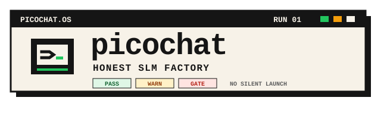
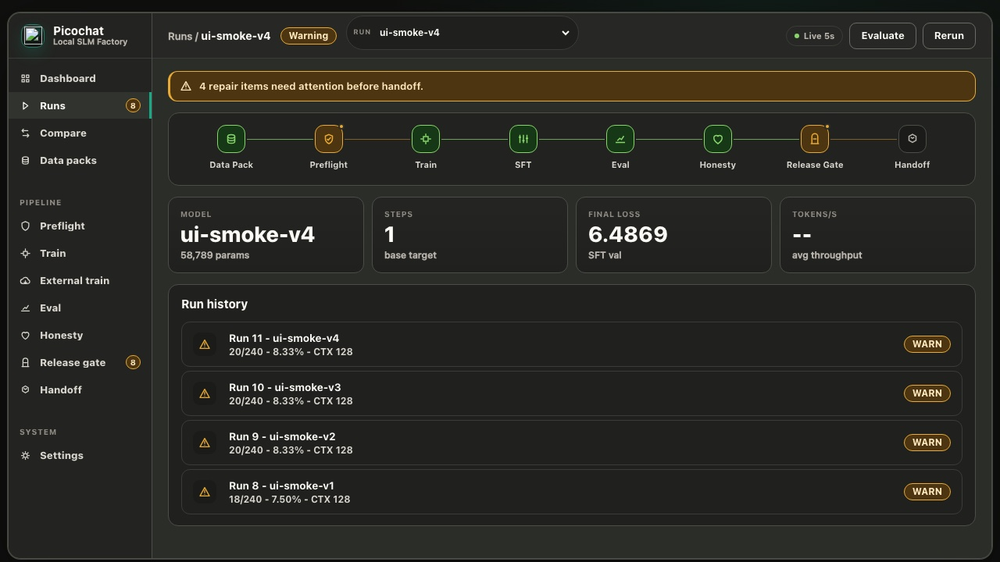
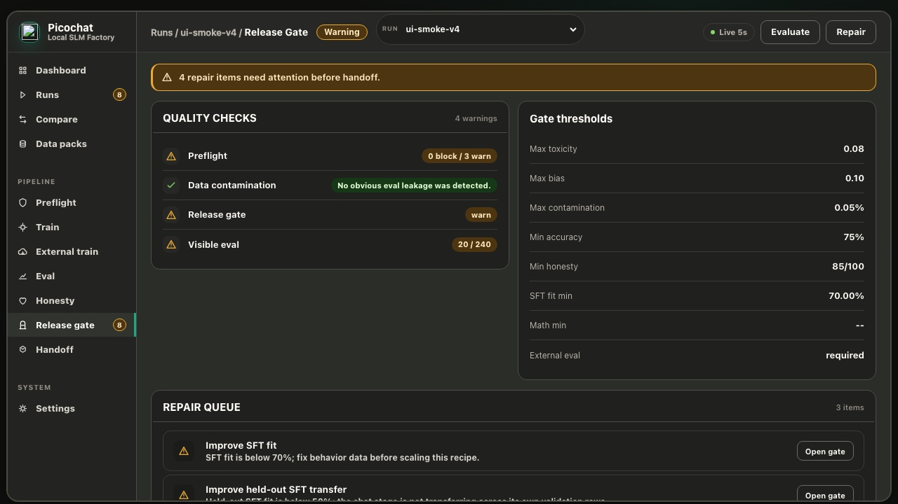
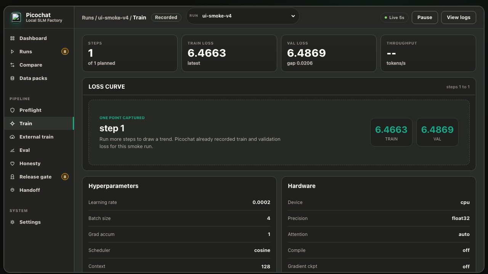
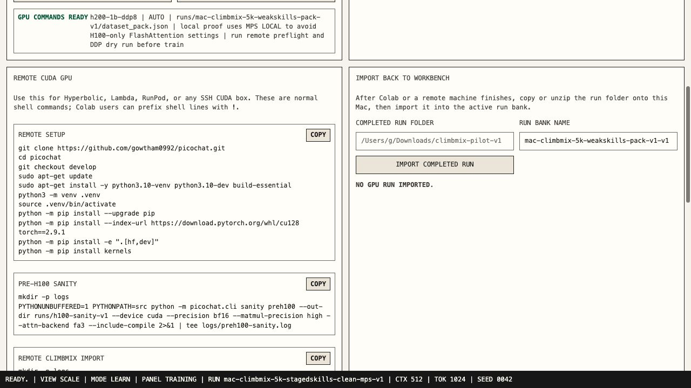

<p align="center">
  
</p>

<h3 align="center">Build small language models without hiding the evidence.</h3>

<p align="center">
  Picochat is an honest SLM training factory: dataset import, tokenizer
  training, base pretraining, SFT, optional DPO, eval, serving, and release
  gates in one inspectable repo.
</p>

<p align="center">
  <a href="https://gowtham0992.github.io/picochat/">Product Page</a> ·
  <a href="https://gowtham0992.github.io/picochat/pipeline_guide.html">Pipeline Guide</a> ·
  <a href="https://gowtham0992.github.io/picochat/h200_1b_runbook.html">1B Runbook</a> ·
  <a href="https://gowtham0992.github.io/picochat/benchmark_protocol.html">Benchmarks</a> ·
  <a href="https://gowtham0992.github.io/picochat/model_registry.html">Registry</a> ·
  <a href="https://gowtham0992.github.io/picochat/release_gates.html">Release Gates</a> ·
  <a href="https://gowtham0992.github.io/picochat/deployment.html">Deploy</a>
</p>

<p align="center">
  <a href="https://github.com/gowtham0992/picochat/stargazers"></a>
  
  
  
  
</p>



## What is Picochat?

Picochat is a from-scratch pipeline for building, checking, and releasing small
language models without hiding data leakage, memorization, weak evals, or
GPU-wasting launch mistakes.

It is inspired by Andrej Karpathy's
[nanochat](https://github.com/karpathy/nanochat), but the product goal is
different. Picochat is not trying to claim frontier behavior from a tiny run.
It is trying to make the whole small-model factory inspectable:

```text
dataset -> tokenizer -> base pretraining -> chat SFT -> optional DPO -> eval -> release gate
```

## Current Status

Picochat is a research-grade training harness and local workbench. The 100M
pilot path has been exercised on H100/H200 instances. The 1B-class
`h200-1b-ddp8` path is prepared for an 8xH100/H200 run with explicit preflight,
DDP dry-run, checkpoint, contamination, token-budget, and post-run release
gates.

What is ready:

- 1B-class decoder-only GPT stack: RoPE, RMSNorm, SwiGLU, GQA, QK norm, tied
  embeddings, parallel residual, scaled residual init, BF16, torch.compile,
  gradient checkpointing, and CUDA/DDP.
- ClimbMix import with corpus manifests, document-boundary checks, and sharded
  token loaders.
- Release-oriented SFT/eval packs for identity, refusal, choice, arithmetic,
  and spelling.
- Preflight checks that block unsafe or dishonest long runs before training.
- Post-run gates that block release when SFT fit, held-out fit, visible eval,
  external benchmarks, prompt echo, refusal behavior, or honesty checks fail.
- A local web dashboard with release readiness, loss curves, preflight output,
  Scale Up commands, paid-GPU confirmation, and DDP dry-run commands.
- Native PyTorch serving through `pico serve`, including local
  OpenAI-compatible `/v1/completions`, `/v1/chat/completions`, and `/v1/models`
  endpoints plus `stream=true` SSE response framing for smoke integrations.
- Optional post-SFT DPO through `pico train dpo` for curated preference pairs
  when teams have real chosen/rejected examples.
- Dockerized local workbench and serving smoke paths for reproducible demos.
- Public benchmark protocol, CI, and contribution templates for external review.

What is not claimed:

- Picochat is not a production assistant.
- Picochat is not RAG.
- Picochat does not claim a useful 1B model before the 1B run and gates pass.
- Synthetic SFT is behavior-focused; it does not magically create knowledge
  the base model never learned.

## Why Picochat Exists

Small-model projects often fail in predictable ways: eval prompts leak into SFT,
validation text overlaps training data, tiny corpora are replayed hundreds of
times, losses are shown without context, checkpoints corrupt on crash, and
large GPU launches start before anyone has run a real preflight.

Picochat treats those as product problems, not afterthoughts.

The factory is built around four principles:

1. **Train visibly.** Every stage writes artifacts that can be inspected and
   compared.
2. **Gate honestly.** Preflight and release checks can block the run or block
   release.
3. **Separate practice from scoring.** SFT rows are practice; eval rows are the
   scoreboard.
4. **Protect GPU spend.** Scale-up commands include sanity checks, preflight,
   a short DDP dry run, and explicit paid-launch confirmation.

Picochat's paid-run path is still deliberately conservative: the 1B release
recipe uses DDP, while experimental FSDP is exposed for base-training smoke
tests before it graduates into the full factory.

On GPU hosts, `pico sanity preh100 --capacity-scale h200-1b-ddp8` can also run
a one-batch memory check for the exact scale before training starts.

## Quick Start

Install locally:

```bash
git clone https://github.com/gowtham0992/picochat.git
cd picochat
python3 -m venv .venv
source .venv/bin/activate
python -m pip install -e ".[dev,hf]"
```

Run the tiny demo:

```bash
PYTHONPATH=src python -m picochat.cli demo
```

Open the workbench:

```bash
PYTHONPATH=src python -m picochat.cli web --runs-dir runs --port 8765
```

Then visit:

```text
http://127.0.0.1:8765
```

The same commands are available through the installed `pico` entry point:

```bash
pico demo
pico web --runs-dir runs --port 8765
```

Or start the workbench with Docker:

```bash
docker compose up --build picochat-web
```

Serve a trained checkpoint through a local OpenAI-compatible API:

```bash
pico serve \
  --checkpoint runs/pico-demo/sft/checkpoint \
  --tokenizer runs/pico-demo/tokenizer.json \
  --host 127.0.0.1 \
  --port 8000
```

Then call:

```bash
curl http://127.0.0.1:8000/v1/chat/completions \
  -H 'content-type: application/json' \
  -d '{"model":"picochat","messages":[{"role":"user","content":"What is Picochat?"}],"max_tokens":80}'
```

This native server is for local smoke tests and integration work. High-throughput
production serving through vLLM, TGI, TensorRT-LLM, or llama.cpp remains future
adapter work.

Run optional DPO after SFT when you have real preference pairs:

```bash
pico data preference-starter \
  --input runs/pico-demo/chat_benchmark.jsonl \
  --out data/preferences.jsonl

pico train dpo \
  --input data/preferences.jsonl \
  --tokenizer runs/pico-demo/tokenizer.json \
  --checkpoint runs/pico-demo/sft/checkpoint \
  --out-dir runs/pico-demo/dpo \
  --learning-rate 0.000005 \
  --beta 0.1
```

Or wire DPO into the end-to-end factory so fit/eval/release gates score the
post-DPO checkpoint:

```bash
pico run tiny \
  --out-dir runs/pico-demo \
  --dataset-pack runs/pack/dataset_pack.json \
  --dpo-input data/preferences.jsonl \
  --dpo-steps 200
```

Preference rows are JSONL with `user` or `prompt`, `chosen`, and `rejected`
fields. DPO improves preference alignment after SFT; it does not replace base
pretraining, SFT coverage, or the release gates.
The preference starter uses synthetic negatives for plumbing and smoke tests;
release alignment needs human or judge-reviewed preference pairs.

Build a model registry from completed runs:

```bash
pico registry --runs-dir runs \
  --out reports/model_registry.md \
  --json-out reports/model_registry.json
```

Write a standard `lm-eval-harness` benchmark command for a HF export:

```bash
pico eval lm-harness \
  --model-path exports/picochat-run \
  --tasks arc_easy,hellaswag \
  --out-dir reports/picochat-run/lm_eval \
  --device cuda:0 \
  --dry-run
```

## 8xH100/H200 Path

The 1B-class path is intentionally gated. The short version is:

```text
setup -> sanity -> ClimbMix import -> release skills pack
  -> preflight -> 100-step DDP dry run -> full run -> SFT/eval -> release gate
```

Read the runbook before spending GPU money:

- [8xH200 1B runbook](https://gowtham0992.github.io/picochat/h200_1b_runbook.html)
- [Release gates](https://gowtham0992.github.io/picochat/release_gates.html)
- [Contamination and honesty checks](https://gowtham0992.github.io/picochat/contamination_and_honesty.html)
- [Benchmark protocol](https://gowtham0992.github.io/picochat/benchmark_protocol.html)

The current `h200-1b-ddp8` scale targets about 1.12B parameters and 22.4B
planned training tokens, roughly 20 tokens per parameter.

## Release Readiness

Picochat does not treat a completed run as a release. A run can finish training
and still be blocked.

The release gate checks:

- preflight status
- token/parameter budget and corpus replay risk
- SFT fit and held-out SFT fit
- visible eval pass rate
- per-skill thresholds for identity, refusal, choice, math, and spelling
- external benchmark presence
- prompt echo and refusal behavior
- corpus/SFT/eval contamination signals
- data honesty report issues



## Workbench

The local dashboard reads real run artifacts. It does not display fake training
progress.

Key stations:

- **Dataset Bay:** corpus preview, import, pack generation, tuning inspection,
  launch preflight, and CLI command preview.
- **Tokenizer Lab:** text-to-token-ID inspection.
- **Training Dash:** base/SFT loss and BPB curves with lower-is-better context.
- **Eval Scoreboard:** pass/fail rows, failure causes, prompt echo, and repair
  guidance.
- **Release Readiness:** the post-run gate in both beginner and research modes.
- **Scale Up:** remote setup, sanity, import, benchmark, preflight, DDP dry run,
  full train, bundle, and return commands.





## Documentation

- [Product page](https://gowtham0992.github.io/picochat/)
- [Architecture](https://gowtham0992.github.io/picochat/architecture.html)
- [Pipeline guide](https://gowtham0992.github.io/picochat/pipeline_guide.html)
- [Benchmark protocol](https://gowtham0992.github.io/picochat/benchmark_protocol.html)
- [Model registry](https://gowtham0992.github.io/picochat/model_registry.html)
- [Release gates](https://gowtham0992.github.io/picochat/release_gates.html)
- [8xH200 1B runbook](https://gowtham0992.github.io/picochat/h200_1b_runbook.html)
- [Contamination and honesty](https://gowtham0992.github.io/picochat/contamination_and_honesty.html)
- [Deployment](https://gowtham0992.github.io/picochat/deployment.html)
- [Task mixture recipe](https://gowtham0992.github.io/picochat/task_mixture_recipe.html)
- [Screenshot capture guide](https://gowtham0992.github.io/picochat/screenshots.html)

To publish the product page with GitHub Pages, set the repository Pages source
to the `docs/` folder on the `develop` or `main` branch.

## Development

Run tests:

```bash
PYTHONPATH=src pytest -q
```

Run only web/dashboard checks:

```bash
PYTHONPATH=src pytest tests/test_web.py -q
```

See [CONTRIBUTING.md](CONTRIBUTING.md) for PR standards and release-evidence
expectations.

Optional TensorBoard logging:

```bash
python -m pip install -e ".[monitor]"
PYTHONPATH=src python -m picochat.cli run tiny \
  --out-dir runs/monitored-smoke \
  --tensorboard-log-dir runs/monitored-smoke/tensorboard
tensorboard --logdir runs/monitored-smoke/tensorboard
```

## License

MIT. See [LICENSE](LICENSE).
