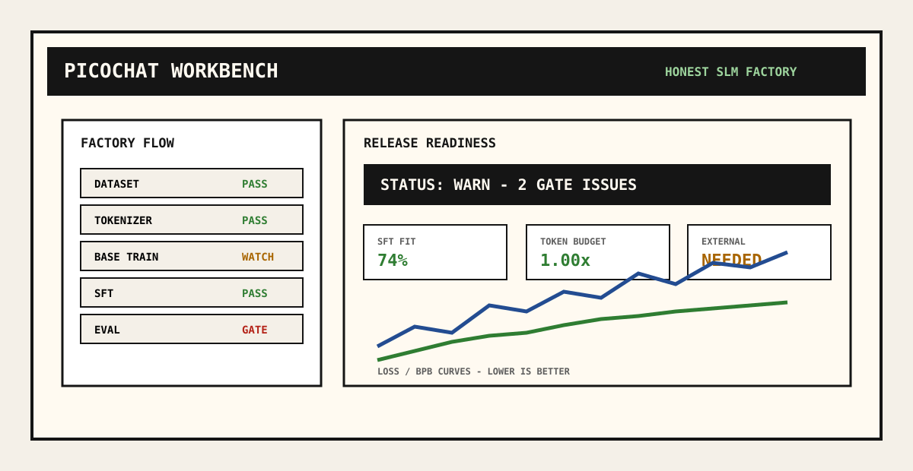
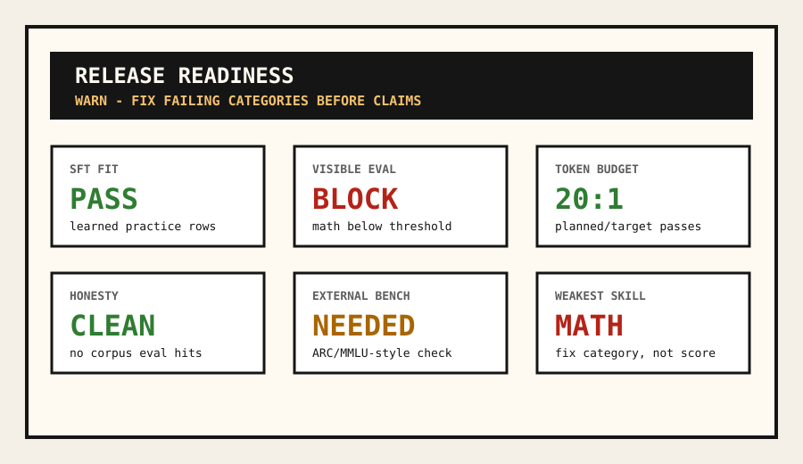
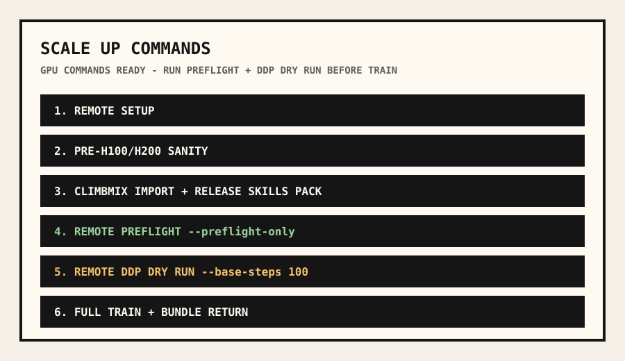

# Picochat

Picochat is an honest SLM training factory: a from-scratch pipeline for
building, checking, and releasing small language models without hiding data
leakage, memorization, weak evals, or GPU-wasting launch mistakes.

It is inspired by nanochat, but the product goal is different. Picochat is not
trying to claim frontier behavior from a tiny run. It is trying to make the
whole small-model factory inspectable:

```text
dataset -> tokenizer -> base pretraining -> chat SFT -> eval -> release gate
```



## Current Status

Picochat is a research-grade training harness and local workbench. The 100M
pilot path has been exercised on H100/H200 instances. The 1B-class
`h200-1b-ddp8` path is prepared for an 8xH100/H200 run with explicit preflight,
DDP dry-run, checkpoint, contamination, token-budget, and post-run release
gates.

What is ready:

- 1B-class decoder-only GPT stack: RoPE, RMSNorm, SwiGLU, GQA, QK norm, tied
  embeddings, parallel residual, scaled residual init, BF16, torch.compile,
  gradient checkpointing, and CUDA/DDP.
- ClimbMix import with corpus manifests, document-boundary checks, and sharded
  token loaders.
- Release-oriented SFT/eval packs for identity, refusal, choice, arithmetic,
  and spelling.
- Preflight checks that block unsafe or dishonest long runs before training.
- Post-run gates that block release when SFT fit, held-out fit, visible eval,
  external benchmarks, prompt echo, refusal behavior, or honesty checks fail.
- A local web dashboard with release readiness, loss curves, preflight output,
  Scale Up commands, paid-GPU confirmation, and DDP dry-run commands.

What is not claimed:

- Picochat is not a production assistant.
- Picochat is not RAG.
- Picochat does not claim a useful 1B model before the 1B run and gates pass.
- Synthetic SFT is behavior-focused; it does not magically create knowledge
  the base model never learned.

## Why Picochat Exists

Small-model projects often fail in predictable ways: eval prompts leak into SFT,
validation text overlaps training data, tiny corpora are replayed hundreds of
times, losses are shown without context, checkpoints corrupt on crash, and
large GPU launches start before anyone has run a real preflight.

Picochat treats those as product problems, not afterthoughts.

The factory is built around four principles:

1. **Train visibly.** Every stage writes artifacts that can be inspected and
   compared.
2. **Gate honestly.** Preflight and release checks can block the run or block
   release.
3. **Separate practice from scoring.** SFT rows are practice; eval rows are the
   scoreboard.
4. **Protect GPU spend.** Scale-up commands include sanity checks, preflight,
   a short DDP dry run, and explicit paid-launch confirmation.

## Quick Start

Install locally:

```bash
git clone https://github.com/gowtham0992/picochat.git
cd picochat
python3 -m venv .venv
source .venv/bin/activate
python -m pip install -e ".[dev,hf]"
```

Run the tiny demo:

```bash
PYTHONPATH=src python -m picochat.cli demo
```

Open the workbench:

```bash
PYTHONPATH=src python -m picochat.cli web --runs-dir runs --port 8765
```

Then visit:

```text
http://127.0.0.1:8765
```

The same commands are available through the installed `pico` entry point:

```bash
pico demo
pico web --runs-dir runs --port 8765
```

## 8xH100/H200 Path

The 1B-class path is intentionally gated. The short version is:

```text
setup -> sanity -> ClimbMix import -> release skills pack
  -> preflight -> 100-step DDP dry run -> full run -> SFT/eval -> release gate
```

Read the runbook before spending GPU money:

- [8xH200 1B runbook](docs/h200_1b_runbook.md)
- [Release gates](docs/release_gates.md)
- [Contamination and honesty checks](docs/contamination_and_honesty.md)

The current `h200-1b-ddp8` scale targets about 1.12B parameters and 22.4B
planned training tokens, roughly 20 tokens per parameter.

## Release Readiness

Picochat does not treat a completed run as a release. A run can finish training
and still be blocked.

The release gate checks:

- preflight status
- token/parameter budget and corpus replay risk
- SFT fit and held-out SFT fit
- visible eval pass rate
- per-skill thresholds for identity, refusal, choice, math, and spelling
- external benchmark presence
- prompt echo and refusal behavior
- corpus/SFT/eval contamination signals
- data honesty report issues



## Workbench

The local dashboard reads real run artifacts. It does not display fake training
progress.

Key stations:

- **Dataset Bay:** corpus preview, import, pack generation, tuning inspection,
  launch preflight, and CLI command preview.
- **Tokenizer Lab:** text-to-token-ID inspection.
- **Training Dash:** base/SFT loss and BPB curves with lower-is-better context.
- **Eval Scoreboard:** pass/fail rows, failure causes, prompt echo, and repair
  guidance.
- **Release Readiness:** the post-run gate in both beginner and research modes.
- **Scale Up:** remote setup, sanity, import, benchmark, preflight, DDP dry run,
  full train, bundle, and return commands.



## Documentation

- [Product page / GitHub Pages entry](docs/index.html)
- [Architecture](docs/architecture.md)
- [Pipeline guide](docs/pipeline_guide.md)
- [Release gates](docs/release_gates.md)
- [8xH200 1B runbook](docs/h200_1b_runbook.md)
- [Contamination and honesty](docs/contamination_and_honesty.md)
- [Task mixture recipe](docs/task_mixture_recipe.md)
- [Screenshot capture guide](docs/screenshots.md)

To publish the product page with GitHub Pages, set the repository Pages source
to the `docs/` folder on the `develop` or `main` branch.

## Development

Run tests:

```bash
PYTHONPATH=src pytest -q
```

Run only web/dashboard checks:

```bash
PYTHONPATH=src pytest tests/test_web.py -q
```

## License

MIT. See [LICENSE](LICENSE).
