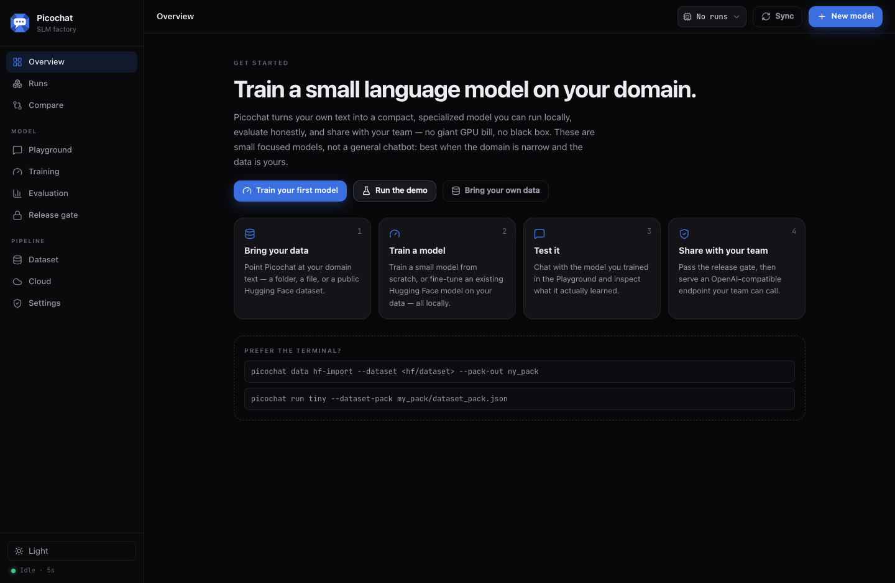
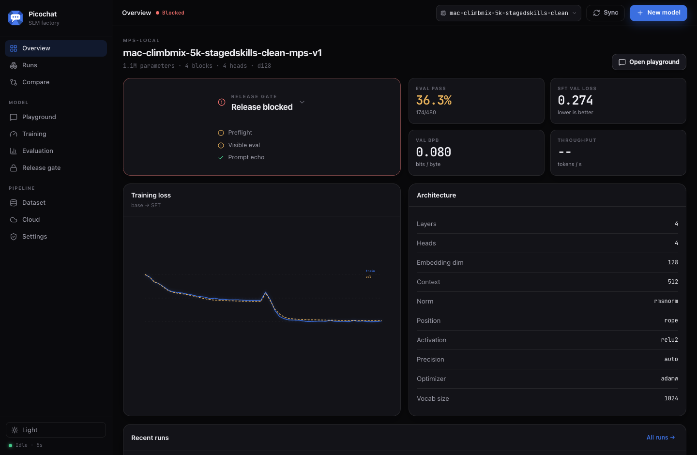
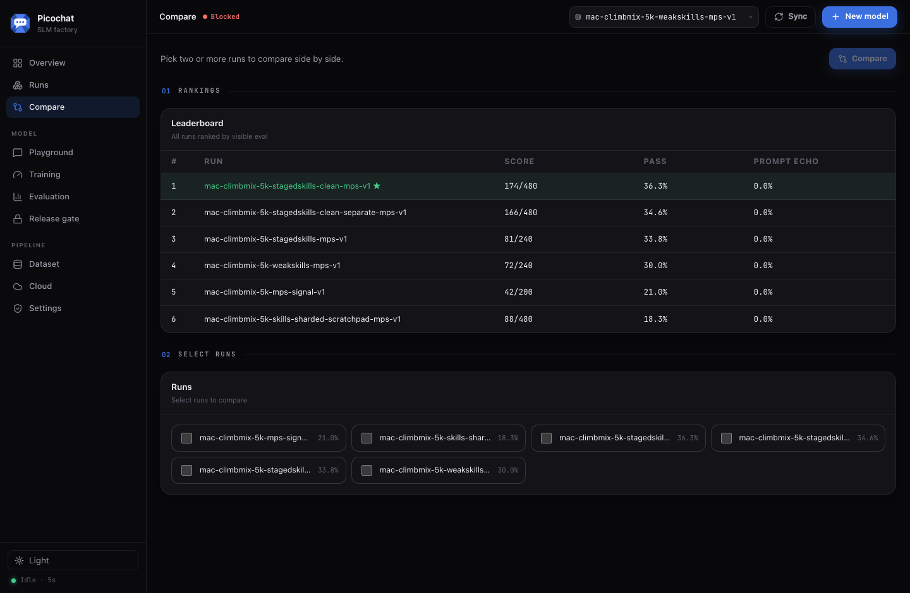
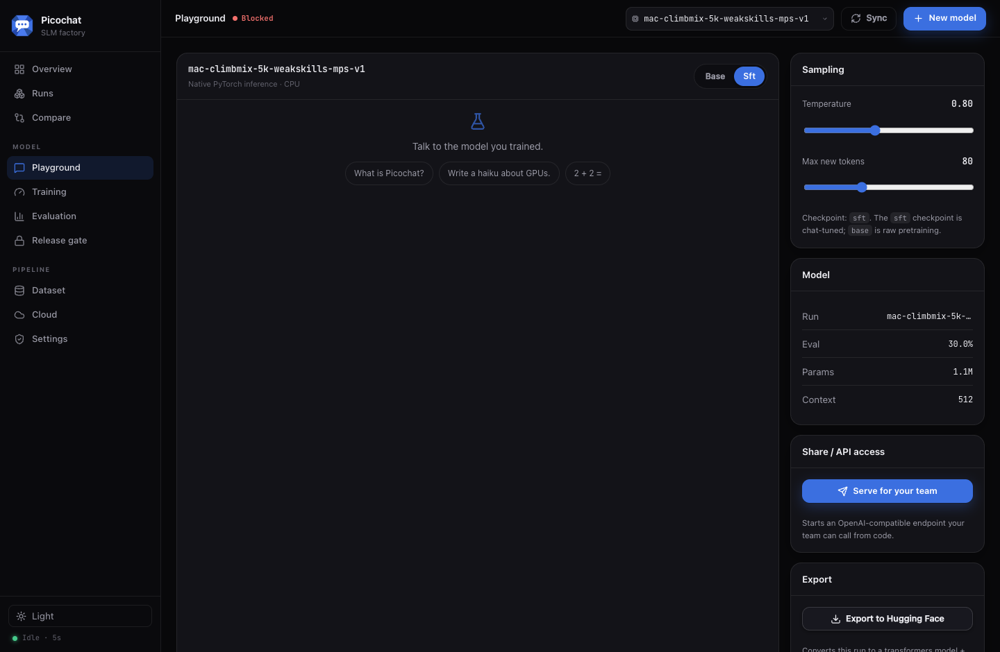
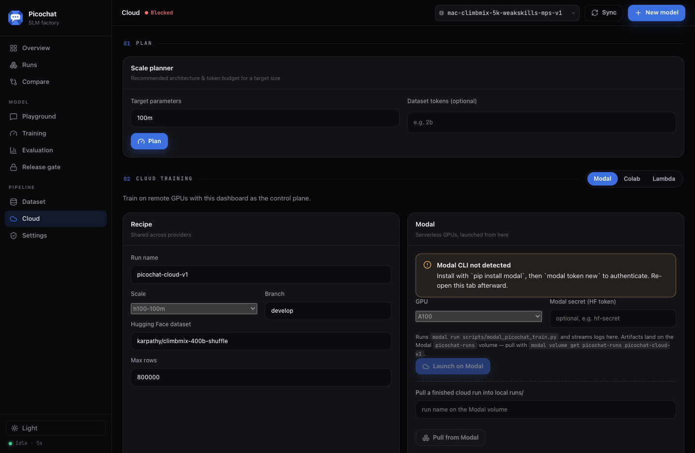

<p align="center">
  
</p>

<h3 align="center">Train a small language model on your domain — without hiding the evidence.</h3>

<p align="center">
  Picochat is a local-first factory for building small, specialized language
  models. Bring your own text, train (from scratch or by fine-tuning an existing
  model), evaluate honestly, chat with it, and serve it to your team — end to
  end, from one dashboard or the CLI.
</p>

<p align="center">
  <a href="https://gowtham0992.github.io/picochat/">Product Page</a> ·
  <a href="https://gowtham0992.github.io/picochat/training_paths.html">Pipeline Guide</a> ·
  <a href="https://gowtham0992.github.io/picochat/model_evidence.html">Honesty Checks</a> ·
  <a href="https://gowtham0992.github.io/picochat/release_gates.html">Release Gates</a> ·
  <a href="https://gowtham0992.github.io/picochat/deployment.html">Deploy</a> ·
  <a href="https://gowtham0992.github.io/picochat/h100_100m_runbook.html">100M Runbook</a> ·
  <a href="https://gowtham0992.github.io/picochat/h200_1b_runbook.html">1B Runbook</a>
</p>

<p align="center">
  <a href="https://github.com/gowtham0992/picochat/stargazers"></a>
  
  
  
  
</p>



## What is Picochat?

Most domain-model projects stall in the same places: there's no clean path from
"I have some text" to "my team can use a model," and the evaluation quietly
leaks, memorizes, or overstates. Picochat fixes both. It is an **end-to-end
small-language-model factory** with a dashboard as the control plane and an
honest evaluation/release gate at its core.

You can drive the whole lifecycle — **no terminal required**:

```text
bring data → build/refine training data → train → evaluate → compare → chat → serve → export
```

…and two ways to start a model:

- **Train from scratch** — `picochat run tiny` (or any scale) builds a
  Picochat-native model: tokenizer → base pretraining → chat SFT → optional DPO
  → eval → release gate.
- **Fine-tune an existing model** — `picochat train hf-sft` starts from a
  Hugging Face causal LM (SmolLM, Qwen, …) and fine-tunes it on your chat data,
  with optional LoRA.

> Picochat builds **small, specialized models** — fast and cheap to run, honest
> about what they do and don't know. Best when the domain is narrow and the data
> is yours. It is not a general chatbot, not RAG, and not a frontier-model claim.

## Do it all from the dashboard

```bash
picochat web --runs-dir runs --port 8765   # then open http://127.0.0.1:8765
```

| | |
|---|---|
| **Bring & refine data** — import a Hugging Face dataset, point at a local folder of docs, generate starter chat/eval, then edit the JSONL in-browser with live validation. | **Train** — a guided wizard (data → check training data → train), from-scratch or fine-tune-existing, with an Advanced panel for architecture, optimizer (Muon), precision, LoRA, and DPO. |
| **Evaluate honestly** — pass/fail with refusal and prompt-echo signals, re-run eval on demand, and view the **honesty / contamination report** that checks for leakage between SFT, eval, and corpus. | **Compare & leaderboard** — rank every run by visible eval, or pick runs for a side-by-side metric matrix. |
| **Chat** — talk to your model (native or fine-tuned HF) in the Playground. | **Serve to your team** — one click starts an OpenAI-compatible `/v1` endpoint with a copy-paste snippet. |
| **Export** — convert a run to a Transformers model + model card to use anywhere. | **Cloud** — launch training on **Modal** (and recipes for **Colab** / **Lambda**) from here, then pull the finished run back to local. |



#### Compare runs and rank them on a leaderboard


#### Chat with your model, then serve it as a team API


#### Train on remote GPUs, with the dashboard as the control plane


## The honest part

Picochat treats evaluation integrity as a product feature, not an afterthought.
Every run can be inspected, compared, and **blocked** — a finished run is not a
release.

- **Separate practice from scoring.** SFT rows are practice; eval rows are the
  scoreboard. Picochat checks they don't overlap.
- **Honesty / contamination report.** Detects exact and near leakage between
  chat SFT, eval prompts, and the base corpus, plus memorization risk.
- **Release gate.** Blocks release when SFT fit, held-out fit, visible eval,
  prompt echo, refusal behavior, external benchmarks, or honesty checks fail —
  surfaced in the dashboard with the underlying markdown reports.
- **Preflight + GPU-spend guards.** Long/paid runs require sanity, preflight,
  and a short DDP dry run, with explicit paid-launch confirmation.

## Quick start

```bash
git clone https://github.com/gowtham0992/picochat.git
cd picochat
python3 -m venv .venv
source .venv/bin/activate
python -m pip install -e ".[dev,hf]"
```

The installed command is `picochat` (a shorter `pico` alias is also provided).

```bash
picochat demo                              # tiny end-to-end demo
picochat web --runs-dir runs --port 8765   # the dashboard
docker compose up --build picochat-web     # …or via Docker
```

## …or from the CLI

The dashboard is a control plane over the CLI; everything is scriptable.

```bash
# Build a dataset pack from a Hugging Face dataset, then train from scratch
picochat data hf-import --dataset <hf/dataset> --pack-out my_pack --max-rows 5000
picochat run tiny --dataset-pack my_pack/dataset_pack.json

# Fine-tune an existing Hugging Face model on your chat data
picochat train hf-sft --model HuggingFaceTB/SmolLM2-135M-Instruct \
  --input my_pack/chat.jsonl --out-dir runs/my-domain-ft --peft lora

# Optional preference alignment after SFT
picochat data preference-starter --input my_pack/chat.jsonl --out data/preferences.jsonl
picochat run tiny --dataset-pack my_pack/dataset_pack.json \
  --dpo-input data/preferences.jsonl --dpo-steps 200

# Rank completed runs and export a model
picochat leaderboard --runs-dir runs --out reports/leaderboard.md
picochat export hf --checkpoint runs/my-run/sft/checkpoint \
  --tokenizer runs/my-run/tokenizer.json --out-dir exports/my-run
```

## Serve your model

One click in the Playground, or:

```bash
picochat serve \
  --checkpoint runs/my-run/sft/checkpoint \
  --tokenizer runs/my-run/tokenizer.json \
  --host 127.0.0.1 --port 8000

curl http://127.0.0.1:8000/v1/chat/completions \
  -H 'content-type: application/json' \
  -d '{"model":"my-run","messages":[{"role":"user","content":"What is Picochat?"}],"max_tokens":80}'
```

`pico serve` is OpenAI-compatible (`/v1/models`, `/v1/completions`,
`/v1/chat/completions`, plus `stream=true` SSE) and can serve either a
native Picochat checkpoint or a fine-tuned Hugging Face model (`--hf-model`).
Binding a non-loopback host automatically requires a bearer key. For
high-throughput production serving, export to HF and run vLLM / TGI / llama.cpp.

## Scale up

Picochat runs from a laptop CPU smoke test to multi-GPU H100/H200. Larger runs
are intentionally gated:

```text
setup → sanity → import → release-skills pack → preflight → DDP dry run → run → SFT/eval → release gate
```

- [100M one-GPU public-proof runbook](https://gowtham0992.github.io/picochat/h100_100m_runbook.html) — `h100-100m`, ~107M params.
- [1B 8×H200 runbook](https://gowtham0992.github.io/picochat/h200_1b_runbook.html) — `h200-1b-ddp8`, ~1.12B params, prepared and gated.
- Public model evidence (trained weights + model card + benchmark + honesty
  report) ships together or not at all — see [Model Evidence](https://gowtham0992.github.io/picochat/model_evidence.html).

## Documentation

- [Product page](https://gowtham0992.github.io/picochat/)
- [Pipeline guide](https://gowtham0992.github.io/picochat/training_paths.html)
- [Architecture](https://gowtham0992.github.io/picochat/architecture.html)
- [Release gates](https://gowtham0992.github.io/picochat/release_gates.html)
- [Contamination and honesty](https://gowtham0992.github.io/picochat/model_evidence.html)
- [Benchmark protocol](https://gowtham0992.github.io/picochat/benchmark_protocol.html)
- [Deployment](https://gowtham0992.github.io/picochat/deployment.html)
- [100M runbook](https://gowtham0992.github.io/picochat/h100_100m_runbook.html) · [1B runbook](https://gowtham0992.github.io/picochat/h200_1b_runbook.html)
- [Security model](SECURITY.md)

Picochat is inspired by Andrej Karpathy's
[nanochat](https://github.com/karpathy/nanochat), with a different goal: make
the whole small-model factory inspectable and usable, not claim frontier
behavior from a tiny run.

## Development

```bash
pytest -q                 # Python tests
npm ci && npm run frontend:check && npm run frontend:build   # the dashboard
ruff check src tests      # lint
```

See [CONTRIBUTING.md](CONTRIBUTING.md) for PR standards and the
release-evidence expectations.

## License

MIT. See [LICENSE](LICENSE).
